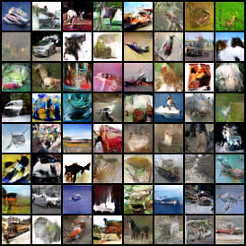

# Contents

<!-- TOC -->

- [Contents](#contents)
- [WGAN-GP Description](#wgan-gp-description)
- [Model Architecture](#model-architecture)
- [Dataset](#dataset)
- [Environment Requirements](#environment-requirements)
- [Quick Start](#quick-start)
- [Script Description](#script-description)
    - [Script and Sample Code](#script-and-sample-code)
    - [Script Parameters](#script-parameters)
    - [Training Process](#training-process)
        - [Standalone Training](#standalone-training)
    - [Inference Process](#inference-process)
        - [Inference](#inference)
- [Model Description](#model-description)
    - [Performance](#performance)
        - [Training Performance](#training-performance)
- [Random Seed Description](#random-seed-description)
- [ModelZoo Home Page](#modelzoo-home-page)

<!-- /TOC -->

# WGAN-GP Description

Wasserstein GAN-Gradient Penalty (WGAN-GP) is a generative adversarial network (GAN) that contains the DCGAN discriminator and generator, which replaces gradient clipping with gradient penalty based on WGAN, and introduces the second derivative of discriminator output relative to its input to the loss function. The gradient penalty, as the function that specifies the loss norm of discriminator, deals with the problems of WGAN model convergence and the generated sample quality.

[Paper](https://arxiv.org/pdf/1704.00028v3.pdf): Improved Training of Wasserstein GANs

# Model Architecture

WGAN-GP consists of a generator network and a discriminator network. The discriminator network adopts the architecture of Deep Convolutional Generative Adversarial Network (DCGAN), that is, 2D convolution with multiple layers. The generator network uses the DCGAN convolutional generator structure. The input data includes the real image data and noise data. The real image of dataset Cifar10 is resized to 32 x 32 and the noise data is generated randomly.

# Dataset

[CIFAR-10](<http://www.cs.toronto.edu/~kriz/cifar.html>)

- Dataset size: 175 MB, 60,000 color images of 10 classes
    - Training set: 146 MB, 50,000 images
    - Note: For the GAN, the test set is not required because the noise data is input to generate images during inference.
- Data format: binary file

# Environment Requirements

- Hardware
    - Set up the hardware environment with Ascend AI Processors.
- Framework
    - [MindSpore](https://www.mindspore.cn/install/en)
- For more information, please check the following resources:
    - [MindSpore Tutorials](https://www.mindspore.cn/tutorials/en/master/index.html)
    - [MindSpore Python API](https://www.mindspore.cn/docs/en/master/index.html)

# Quick Start

After installing MindSpore from the official website, you can perform the following steps for training and evaluation:

- Running in the Ascend AI Processor Environment

  ```python
  # Standalone training:
  bash run_train.sh [DATAROOT] [DEVICE_ID]


  # Evaluation
  bash run_eval.sh [DEVICE_ID] [CONFIG_PATH] [CKPT_FILE_PATH] [OUTPUT_DIR] [NIMAGES]
  ```

# Script Description

## Script and Sample Code

```bash
├── model_zoo
    ├── README.md                      // Description of all models
    ├── WGAN-GP
        ├── README.md                  // WGAN-GP description
        ├── scripts
        │   ├── run_train.sh          // Shell script for standalone training on Ascend AI Processors
        │   ├──run_eval.sh              // Shell script for evaluation on Ascend AI Processors
        ├── src
        │   ├── dataset.py             // Create a dataset and preprocess data.
        │   ├── model.py               // Definition of the WGAN-GP generator and discriminator
        │   ├── args.py                // Parameter configuration file
        │   ├── cell.py                // Model single-step training file
        ├── train.py                   // Training script
        ├── eval.py                    // Evaluation script
```

## Script Parameters

You can configure training parameters, evaluation parameters, and model export parameters in **args.py**.

  ```python
  # common_config
  'device_target': 'Ascend', # Running device
  'device_id': 0, # ID of the device used for training or evaluating the dataset

  # train_config
  'dataroot': None, # Dataset path, which is mandatory and cannot be empty.
  'workers': 8, # Number of data loading threads
  'batchSize': 64, # Batch size
  'imageSize': 32, # Image size
  'DIM': 128, # Size of the hidden layer of the GAN
  'niter': 1200, # Number of epochs for network training
  'save_iterations': 1000, # Number of generator iterations for saving a model file
  'lrD': 0.0001, # Initial learning rate of the discriminator
  'lrG': 0.0001, # Initial learning rate of the generator
  'beta1': 0.5, # Beta 1 parameter of the Adam optimizer
  'beta2': 0.9, # Beta 2 parameter of the Adam optimizer
  'netG': '', # CKPT file path for the generator that resumes training
  'netD': '', # CKPT file path for the discriminator that resumes training
  'Diters': 5, # Number of the discriminator needs to be trained for each training of the generator
  'experiment': None, # Path for saving the model and generating the image. If this parameter is not specified, the default path is used.

  # eval_config
  'ckpt_file': None, # Path for the generator weight file .ckpt saved during training, which must be specified.
  'output_dir': None, # Output path for the generated image, which must be specified.
  ```

For details about configuration, see the `args.py`.

## Training Process

### Standalone Training

- Running in the Ascend AI Processor Environment

  ```bash
  bash run_train.sh [DATAROOT] [DEVICE_ID]
  ```

  The preceding Python command is executed in the backend. You can view the result in the **train.log** file.

  After the training is complete, you can find the generated images, checkpoint files, and JSON files in the storage folder (./samples by default). The following methods are used to achieve the loss value:

  ```bash
  [0/1200][230/937][23] Loss_D: -379.555344 Loss_G: -33.761238
  [0/1200][235/937][24] Loss_D: -214.557617 Loss_G: -23.762344
  ...
  ```

## Inference Process

### Inference

- Evaluation on Ascend AI Processors

  Before running the following command, check the checkpoint and JSON file path used for inference and set the path for the output images.

  ```bash
  bash run_eval.sh [DEVICE_ID] [CKPT_FILE_PATH] [OUTPUT_DIR]
  ```

  The preceding Python command runs in the backend. You can view the log information in the **eval/eval.log** file and view the generated images in the output image path.

# Model Description

## Performance

### Training Performance

| Parameter                       | Ascend                                                     |
| -------------------------   | -----------------------------------------------------      |
| Resources                       | Ascend 910 AI Processor; 2.60 GHz CPU with 192 cores; 755 GB memory                 |
| Upload date                   | 2022-08-01                                                  |
| MindSpore version              | 1.8.0                                                       |
| Dataset                     | CIFAR-10                                                    |
| Training parameters                   | max_epoch=1200, batch_size=64, lr_init=0.0001               |
| Optimizer                     | Adam                                                        |
| Loss function                   | Customized loss function                                              |
| Output                       | Generated images                                                  |
| Speed                       | Single device: 0.06 s/step                                             |

The following shows a sample of the generated images.



# Random Seed Description

We set a random seed in **train.py**.

# ModelZoo Home Page

 For details, please go to the [official website](https://gitee.com/mindspore/models).
