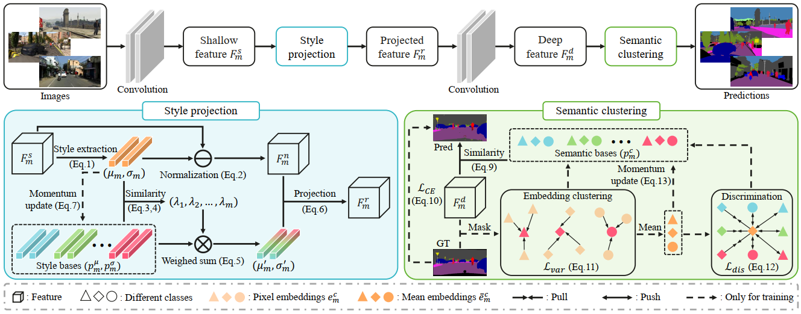

# Contents

[TOC]

## SPC-Net overview

SPC-Net(Style Projected Clustering Network) proposes a semantic segmentation method based on style representation.

Existing semantic segmentation methods improve generalization capability, by regularizing various images to a canonical feature space. While this process contributes to generalization, it weakens the representation inevitably. In contrast to existing methods, we instead utilize the difference between images to build a better representation space, where the distinct style features are extracted and stored as the bases of representation. Then, the generalization to unseen image styles is achieved by projecting features to this known space. By measuring the similarity distances to semantic bases (i.e., prototypes), we replace the common deterministic prediction with semantic clustering. Comprehensive experiments demonstrate the advantage of proposed method to the state of the art, up to 3.6% mIoU improvement in average on unseen scenarios.

[CVPR2023 Style Projected Clustering for Domain Generalized Semantic Segmentation](https://openaccess.thecvf.com/content/CVPR2023/papers/Huang_Style_Projected_Clustering_for_Domain_Generalized_Semantic_Segmentation_CVPR_2023_paper.pdf)

## Model architecture

The structure of the SPC-Net model is as follows:



## Dataset

- Synthetic datasets
    - **GTAV** (Playing for Data: Ground Truth from Computer Games) [[paper](https://link.springer.com/chapter/10.1007/978-3-319-46475-6_7)][[website](https://download.visinf.tu-darmstadt.de/data/from_games/)]
    - **Synthia** (The SYNTHIA Dataset: A Large Collection of Synthetic Images for Semantic Segmentation of Urban Scenes) [[paper](https://www.cv-foundation.org/openaccess/content_cvpr_2016/html/Ros_The_SYNTHIA_Dataset_CVPR_2016_paper.html)][[website](http://synthia-dataset.net/)]

- Real-world datasets
    - **IDD** (IDD: A Dataset for Exploring Problems of Autonomous Navigation in Unconstrained Environments) [[paper](https://ieeexplore.ieee.org/abstract/document/8659045/)][[website](http://idd.insaan.iiit.ac.in/)]
    - **Cityscapes** (The Cityscapes Dataset for Semantic Urban Scene Understanding) [[paper](https://openaccess.thecvf.com/content_cvpr_2016/html/Cordts_The_Cityscapes_Dataset_CVPR_2016_paper.html)][[website](https://www.cityscapes-dataset.com/)]
    - **BDD** (BDD100K: A Diverse Driving Dataset for Heterogeneous Multitask Learning) [[paper](https://openaccess.thecvf.com/content_CVPR_2020/html/Yu_BDD100K_A_Diverse_Driving_Dataset_for_Heterogeneous_Multitask_Learning_CVPR_2020_paper.html)][[website](https://www.bdd100k.com/)]
    - **Mapillary** (The Mapillary Vistas Dataset for Semantic Understanding of Street Scenes) [[paper](https://openaccess.thecvf.com/content_iccv_2017/html/Neuhold_The_Mapillary_Vistas_ICCV_2017_paper.html)][[website](https://www.mapillary.com/)]

## Environmental requirements

- Hardware: indicates a GPU and CPU equipped machine
- Deep learning framework: MindSpore 1.9.0
- For details, see the following resources:
    - [MindSpore Tutorials](https://www.mindspore.cn/tutorials/en/master/index.html)
    - [MindSpore Python API](https://www.mindspore.cn/docs/en/master/index.html)

## Quick Start

The following is a description and example of code running:

```bash
python eval.py --root DATA_PATH
               --dataset DATASET_NAME
               --num NUMBER_SOURCE_DATASET
# For example
python eval.py --root /path/to/Datasets
               --dataset cityscapes
               --num 2
```

## Code description

```path
.
├─network
    ├─kaiming_normal.py             # Definition of the Parameter Initialization Method
    ├─network.py                    # Model definition of SPC-Net
    ├─Resnet.py                     # Model definition of ResNet
    ├─styleRepIN.py                 # Definition of the style representation module
├──src
    ├──cityscapes_labels.py         # Dataset Label Definition
    ├──dataset.py                   # Dataset Definition
    ├──utils.py                     # Definition of drawing and evaluation
├──models                           # path of trained models
├──eval.py                          # script of evaluation
├──requirements.txt                 # configuration of python packages
└──README.md                        # README File
```

### Performance

The average inference latency of 2048 x 1024 images on a single V100 GPU is within 10 ms.

## ModelZoo home page

Please browse the website home page (<https://gitee.com/mindspore/models>).