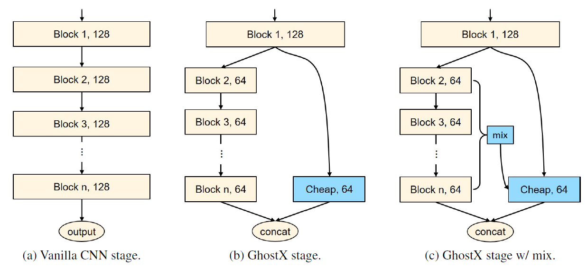
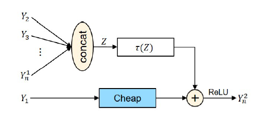

# Contents

- [Contents](#contents)
    - [Algorithm Introduction](#algorithm-introduction)
    - [Algorithm Principles](#algorithm-principles)
        - [Configuring the training process](#configuring-the-training-process)
    - [Dataset](#dataset)
    - [Requirements](#requirements)
        - [Hardware (Ascend)](#hardware-ascend)
        - [Framework](#framework)
    - [For more information, please check the resources below](#for-more-information-please-check-the-resources-below)
        - [Script Description](#script-description)
        - [Scripts and Sample Code](#scripts-and-sample-code)
    - [Script Parameter](#script-parameter)
    - [Training Process](#training-process)
        - [For training](#for-training)
    - [Evaluation](#evaluation)
        - [Evaluation Process](#evaluation-process)
        - [Evaluation Result](#evaluation-result)
    - [ModeZoo Homepage](#modelzoo-homepage)

## Algorithm Introduction

GhostNeXt is an efficient network architecture, which can obtain high performance on GPUs in terms of both accuracy and latency. Current networks usually use depth-wise convolution to reduce latency, but a GPU-efficient network architecture should not contain too much trivial computation in a building stage. Therefore, we present to utilize the stage-wise feature redundancy to formulate GhostX stage structure. The new GhostX stage can be well embedded into any mainstream CNN architectures.

### Paper

[GhostNets on Heterogeneous Devices via Cheap Operations](https://arxiv.org/pdf/2201.03297.pdf)

## Algorithm Principles

The features will be split into two parts where the first part is processed using the original block with fewer output channels for generating intrinsic features, and the other are generated using cheap operations by exploiting stage-wise redundancy. To further enhance their representation capacity, we embed the information of intermediate intrinsic features into the cheap operation for compensation. The following figure shows the proposed GhostX stage:



To complement the lacked information, we propose to utilize the intermediate features in the complicated path to enhance the representation capacity of the cheap operations. Mix operation for aggregating the intermediate information into the ghost features.



We apply a global average pooling to obtain the aggregated feature, then transform the aggregated feature into the same domain as the origin output.

For Davincit chips, the slicing operation will introduce a larger latency so we apply 1x1 convolution to replace it. In this work, we apply the proposed GhostX stage on ResNets to obtain GhostNets_D.

### Configuring the training process

For details, see the configuration file src/ghostnet_d.yml in the sample code.

```yaml

general:
    backend: mindspore
    parallel_fully_train: True

pipeline: [fully_train]

fully_train:
    pipe_step:
        type: TrainPipeStep

    model:
        model_desc:
            type: ./src/ghostnet_d.ghostnet101

    trainer:
        type: Trainer
        epochs: 120
        mixup: True
        optimizer:
            type: SGD
            params:
                lr: 0.001
                momentum: 0.9
                weight_decay: 0.0001
        lr_scheduler:
            type: CosineAnnealingLR
            by_epoch: True
            params:
                T_max: 120
        loss:
            type: CrossEntropyLoss
            params:
                sparse: True
```

## Dataset

The benchmark datasets can be downloaded as follows:

[ImageNet2012](https://image-net.org/challenges/LSVRC/2012/).

After downloaded the correspond dataset to the target place, You can configure and use the dataset separately for train and test.

Dataset configuration parameters in src/ghostnext_d.yml:

```yaml
        type: Imagenet
        common:
            data_path: "/cache/datasets/ILSVRC/Data/CLS-LOC"
            batch_size: 128
            n_class: 1000
```

## Requirements

### Hardware (Ascend)

> Prepare hardware environment with Ascend.

### Framework

> [MindSpore](https://www.mindspore.cn/install/en)

### For more information, please check the resources below

[MindSpore Tutorials](https://www.mindspore.cn/tutorials/en/r1.6/index.html)

[MindSpore Python API](https://www.mindspore.cn/docs/api/en/r1.6/index.html)

## Script Description

### Scripts and Sample Code

```bash
ghostnet_d
├── eval.py # inference entry
├── train.py # pre-training entry
├── README.md # Readme
├── scripts
│   ├── run_standalone.sh # shell script for standalone train on ascend
│   ├── run_distributed.sh # shell script for distributed train on ascend
└── src
    ├── eval.yml  # options/hyper-parameters of eval
    └── ghostnet_d.yml # options/hyper-parameters of ghostnet_d
```

### Script Parameter

> For details about hyperparameters, see src/ghostnet_d.yml.

## Training Process

### For training

- Standalone Ascend Training:

```bash
bash scripts/run_standalone.sh
```

- Distributed Ascend Training:

```bash
bash scripts/run_distributed.sh  [RANK_TABLE_FILE]
```

  For distributed training, a hccl configuration file with JSON format needs to be created in advance.

  Please follow the instructions in the link below:

  <https://gitee.com/mindspore/models/tree/master/utils/hccl_tools>.

`$RANK_TABLE_FILE` is needed when you are running a distribute task on ascend.

> Or one can run following script for all tasks.

```bash
python3 train.py
```

## Evaluation

### Evaluation Process

> Inference example:

Modify src/eval.yml:

```text
models_folder: [CHECKPOINT_PATH]
```

```text
python3 eval.py
```

### Evaluation Result

The result are evaluated by the value of accuracy and parameters.

```text
INFO Best values: [{'worker_id': '0', 'performance': {'accuracy_top1': 0.7735977564102564,'flops': 0.0, 'params': 38216.872}}]
```

## ModelZoo Homepage

Please check the official [homepage](https://gitee.com/mindspore/models).